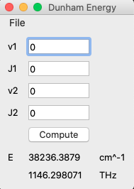

# Challenge 7: Dunham Energy GUI

## Goals
The purpose of this challenge is to create a simple GUI using PyQt5 in python.  The GUI parameters shall be as followed:
1. 4x QLineEdit fields to input v1,J1,v2, and J2
2. 1x QPushButton that uses the Dunhan expression and line_config.ini to generate the transisition energy
3. QLabel for everything including units!

Your GUI should look something like this:

## Hints:

1. Instead of re-inventing the wheel, you can import your functions from Challenge 5 that you used.

`from daniel5 import *`

Keep in mind that you must put your import script in the same folder (unless you want to figure out adding paths to the python path).

2. I included a gui template that I made a year ago or so.  You are welcome to use it as a starting point!  Just make sure to "Save As" a different file so you don't overwrite the template.

3. I included a script I found online that introduces many of the common GUI features in a "throw it at you all at once" manner.  I use it as a reference if I can't remember exactly how to do something.
